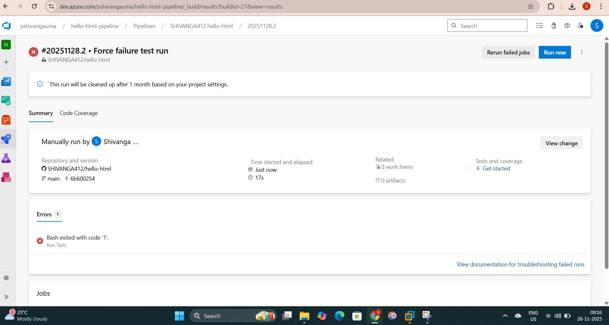

# Hello HTML Azure DevOps Pipeline

This project uses an Azure DevOps YAML pipeline with a self-hosted Kali Linux agent to build and deploy a simple HTML page.
## Screenshots

### Pipeline failure

### Pipeline success

### Deployment on Kali (localhost)

Steps you followed
Set up a self-hosted Azure DevOps agent on Kali Linux and connected it to my Azure DevOps project.

Created a GitHub repository with a simple HTML page and an azure-pipelines.yml file for CI/CD.

Configured the pipeline to trigger on main, build and test the app, publish artifacts, and deploy files to /var/www/html on the Kali VM.

Ran the pipeline multiple times until it succeeded and verified the page at http://localhost in the Kali browser.

Explanation of rollback logic
A separate step is configured with condition: failed() so it runs only when a previous task in the pipeline fails.

This step represents rollback logic: it can restore an earlier build or undo changes so the system returns to a known good state when deployment fails.

Summary of what you learned
Learned how to connect a self-hosted Linux agent to Azure DevOps and run pipelines on my own VM.

Understood how YAML pipelines are structured with triggers, pools, steps, conditions, and artifact publishing.

Practiced automating deployment of a static HTML page to a web server and validating it through the browser.

Experienced how pipeline failures look, how to read logs, and how to fix configuration or script issues
